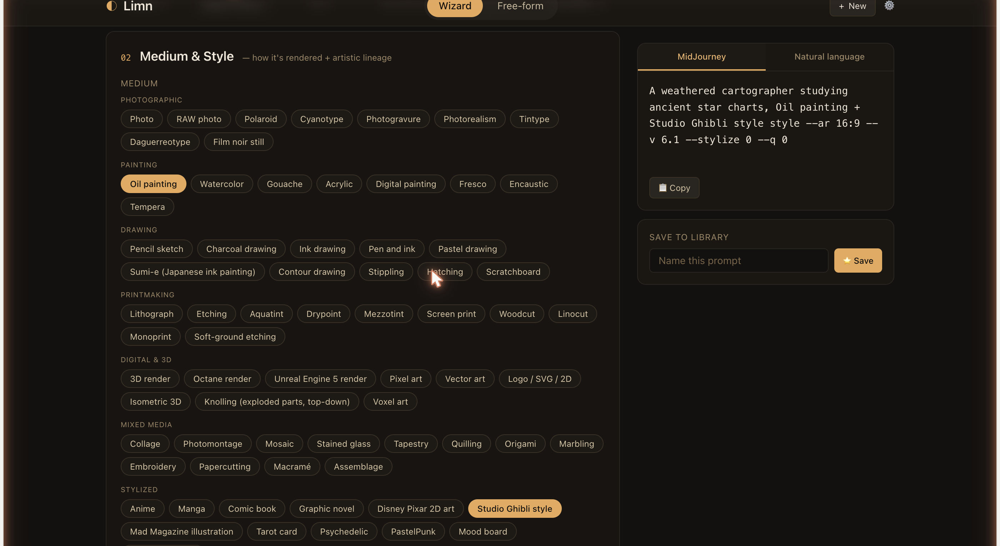

# Limn

> *limn* (verb) — to depict or describe in painting or words.



An open-source, AI-scaffolded prompt designer for image generation. Start from nothing with a guided wizard, paste a half-formed idea and let the chip library + AI flesh it out, or parse an existing prompt back into editable slots. Model-agnostic output for MidJourney, Stable Diffusion, FLUX, DALL·E, and plain natural language.

🔗 **Live demo:** [nnnsightnnn.github.io/limn](https://nnnsightnnn.github.io/limn/)

> **Status:** v0.1 — MidJourney wizard + free-form modes shipped. Multi-model output, prompt parsing, and library polish coming in v0.2+.

## Why another prompt tool

There are good wizard-style builders out there (Promptomania, IMI Prompt, PromptFolder), but they all start the same way: empty dropdowns waiting for you to know what you want. Limn's wedge:

- **AI-first scaffolding** — describe a vague idea, get a full prompt skeleton you can edit. Powered by your own OpenRouter key, so you pick the model (Claude, GPT, Gemini, Llama, …).
- **Bidirectional** — wizard *or* free-form, with round-trip: parse a freeform prompt back into structured slots, edit, re-assemble.
- **BYO key, no SaaS** — your key lives in `localStorage`, never on a server. Use it for years, no subscription, no shutdown risk.
- **Open source, MIT** — fork it, extend the vocabulary, add your own chip categories.

## Stack

- **Vite + React + TypeScript** — modern, fast HMR, room to grow
- **Tailwind CSS v4** — utility-first styling via `@tailwindcss/vite`
- **localStorage** for the saved prompt library and OpenRouter key — nothing leaves your machine except the AI calls you trigger
- **GitHub Pages** for the live deploy

## Project layout

```
limn/
├── src/
│   ├── App.tsx                # shell + mode switcher
│   ├── components/            # WizardMode, FreeformMode, OutputPanel, etc.
│   ├── lib/                   # OpenRouter client, prompt assembler, parsers
│   ├── data/                  # vocabulary JSON (mediums, lighting, shots, …)
│   └── index.css              # Tailwind entry
├── docs/
│   ├── midjourney-v6.1-cheat-sheet.txt    # source: prompt structure
│   └── cinematic-template.txt             # source: shot types, mediums
├── .github/workflows/deploy.yml           # auto-deploy to GitHub Pages
├── index.html
├── vite.config.ts
├── package.json
├── LICENSE                                # MIT
└── README.md
```

## Running locally

```bash
git clone https://github.com/Nnnsightnnn/limn.git
cd limn
npm install
npm run dev
```

Then visit `http://localhost:5173`.

Optional: open the Settings drawer in the app and paste an [OpenRouter](https://openrouter.ai) API key to enable AI-assisted suggestions. The key is stored only in `localStorage` and sent only with requests you trigger.

## Roadmap

- [x] **v0** — scaffold (this commit)
- [ ] **v0.1** — MidJourney vertical slice: wizard + free-form + AI assist + output + library (one model end-to-end)
- [ ] **v0.2** — multi-model output rendering (NL / MJ / SD / FLUX / DALL·E)
- [ ] **v0.3** — bidirectional parser (paste a prompt, get structured slots)
- [ ] **v0.4** — prompt library polish: search, tags, export
- [ ] **v0.5** — mobile layout, keyboard shortcuts, theming
- [ ] **v1.0** — first tagged release + public listing

## Inspiration & honest comparisons

- **[Promptomania](https://promptomania.com/prompt-builder)** — 68-model wizard builder, the category leader. Limn is narrower, more opinionated, and AI-scaffolded.
- **[intelligencedev/PromptForge](https://github.com/intelligencedev/PromptForge)** — visual library of style prompts. Different scope (manager vs composer); good companion tool.
- **[IMI Prompt](https://www.imiprompt.com/builder)** — MidJourney-specific wizard with deep preset library.

## License

MIT — see [LICENSE](./LICENSE).
